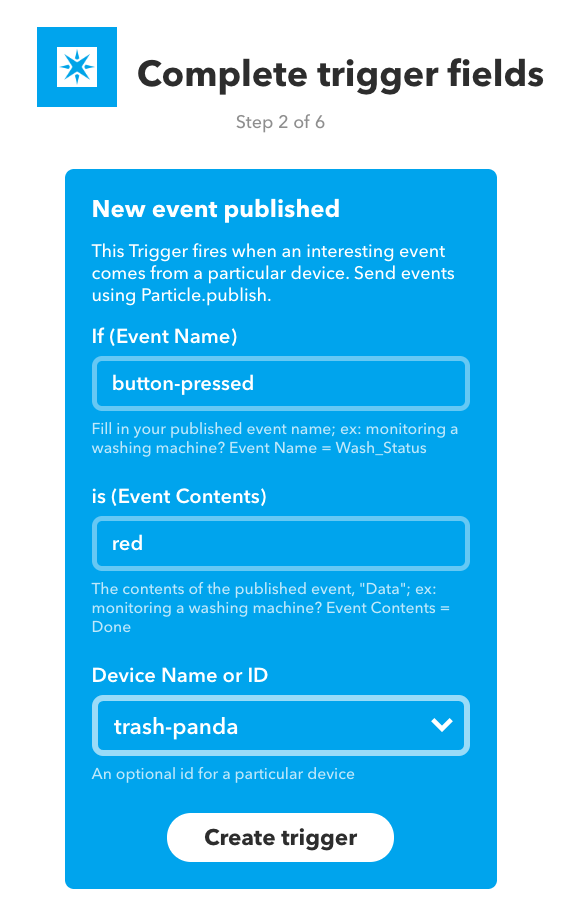
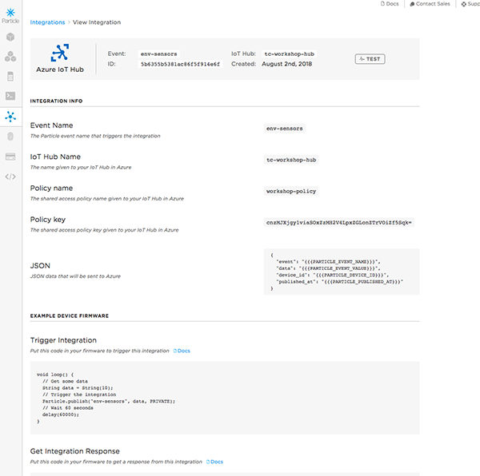

# Chapter 4: Going Beyond Devices

| **Project Goal**            | Connect your badge to 3rd party services and "backhaul" sensor data to the cloud.                               |
| --------------------------- | --------------------------------------------------------------------------------------------------------------- |
| **What you’ll learn**       | How to work with the Particle CLI; Building integrations with IFTTT; Piping sensor data into the Azure IoT Hub. |
| **Tools you’ll need**       | Particle Dev (Desktop IDE), a Particle Photon and #PartiBadge                                                   |
| **Time needed to complete** | 30 minutes                                                                                                      |

## Exploring the Particle CLI and Cloud API

### The Particle CLI

1.  If you haven't already, [install the Particle CLI](https://docs.particle.io/guide/tools-and-features/cli/photon/). Open a terminal window and type the following command:

```bash
bash <( curl -sL https://particle.io/install-cli )
```

2.  Type `particle login` and enter your Particle account email and password when prompted.


3.  Once you're logged in, type `particle list` to see your list of online devices.


4.  The device we've been using for this workshop has 3 variables and two functions. Get the value of the `temp` variable with the command `particle get temp`.


5.  We can also call one of the two functions to light up the yellow or blue LED button. Type the command `particle call <your-device-name> toggleB` in the terminal. Run the same command again to turn the light off.


### The Particle Device Cloud API

Behind the scenes, every interface that Particle provides to work with devices, from the console to, mobile apps, SDKs and the CLI talks through a RESTful Device Cloud API, which you can also call yourself, directly.

_The next few steps assume you have cURL installed on your machine. If you don't have this command-line utility on your machine, you can download and install it [here](https://curl.haxx.se/download.html) or use a GUI-based tool like [Postman](https://www.getpostman.com/)._

1.  First, you'll need to obtain an access token from the CLI. Type `particle token list` to view the tokens associated with your account. The first one listed is your `user` token, and can be used to access the Device Cloud API. If no tokens are listed, generate a new one with `particle token new`.

2.  With your token and Device ID in hand, type the following cURL command into a terminal window, replacing the text below in `< >` with your information.

```bash
curl https://api.particle.io/v1/devices?access_token=<your token>
```

By default, the response will generate a wall of text in your terminal. If you have Python 2.6+ installed on your machine, you can pipe the output to the `json.tool` and get pretty-printed JSON.

```bash
curl https://api.particle.io/v1/devices\?access_token\=<your token>
| python -m json.tool
```


3.  For this next command, you need the Device ID of the Photon attached to your badge. You can find that in the console or via the `particle list` CLI command.

4.  Let's call the `toggleB` function using the Device Cloud API. Type the following, again replacing the text below in `< >` with your information.

```bash
curl https://api.particle.io/v1/devices/3<device id>/toggleB \
     -d access_token=<your token>
```


With that, you've now explored all of the ways that you can interface with the Particle Device cloud and your connected devices! Now, let's go beyond the Particle ecosystem and explore some of the ways that you can integrate with other 3rd party services, and backhaul your data into other cloud services.

## Exploring Integrations with IFTTT

IFTTT (If This, Then That) is a web-based services that allows you to create integrations via simple conditional statements, called applets. There are hundreds of pre-build services you can leverage, and first-class support for Particle devices. In this section, we're going to create an IFTTT integration that posts a tweet when you press a button on your badge.

1.  Start by heading over to [IFTTT](https://ifttt.com) and either login, or create a new account.


2.  After logging in, click "New Applet" in the top right of your dashboard.


3.  Click the "+this" button.


4.  In the "Search services" input, type "particle" and click on the Particle card.


5.  Click on the "New event published" card.


6.  In the trigger fields, set the event name as `button-pressed` the event contents to `red` and the Device name to the name of your device. Click "create trigger"



7.  You've set up the trigger on the Particle end, now its time for the **That** portion of the setup. Click the "+that" button.


8.  Select the "Twitter" card.


9.  Click the "Post a tweet" action card. You may be prompted to connect your Twitter account to IFTTT at this point. Follow the instructions provided to do so.


10. For the tweet text, copy the following, or customize as you wish. The text in double-brackets ({{}}) is replacement text based on the input event from Particle. You can click "Add ingredient" to see what other fields are available to use. Click "Create action" when you're done.

```
My #PartiBadge is tweeting! {{DeviceName}} published {{EventName}}
with data {{EventContents}}
```


11. Click "Finish"


12. You're all set! Toggle the switch to turn your action on if it isn't by default.


13. Now, we need to modify our badge firmware to publish an event when the red button is pressed. Add the following to the `loop` function:

```cpp
redButtonADebouncer.update();
if (redButtonADebouncer.read() == HIGH)
{
  digitalWrite(yellowLED, HIGH);
}
else
{
  digitalWrite(yellowLED, LOW);
  Particle.publish("button-pressed", "red", MY_DEVICES);
}
```

14. Flash the firmware to your badge and press the red button a few times.

15. Head over to your Twitter account and see your Particle-powered tweet! _Note: it may take a few minutes for IFTTT to pick up the event._


## Getting Device Data into Azure IoT

### Setting up an Azure IoT Hub

1.  Sign up for an [Azure Account](https://azure.microsoft.com/en-us/get-started/), or sign in if you already have one.


2.  In the dashboard, click "Create a resource." Click "Internet of Things," then "IoT Hub" at the top of the list.


3.  Create a new resource group named `workshop-group` and give the hub a name. The name must be unique across all of Azure, but you'll receive a notification if the name you selected is not unique.


4.  Click "Review + create".


5.  Click "Create".


6.  You'll get a notification that your IoT Hub is being deployed, which may take a few minutes. Once done, pin the hub to your dashboard.


7.  Click "Go to resource" to open the hub.


8.  Click "Shared access policies". We'll create a policy to allow the Particle Device Cloud to stream events into the hub.

9.  Give the policy the name `workshop-policy`, select all four permissions, then click "Create."


10. Open the policy you just created and copy the "Primary key."


Now we can complete setting up this integration from the Particle Console.

### Setting up the Particle Integration

1.  Navigate to [console.particle.io](https://console.particle.io) and click the "Integrations" menu item.


2.  Click "New Integration."


3.  Choose "Azure IoT Hub."


4.  You'll see a "Setup required" notice. We've already done all the things needed here, so you can click on "I have done all these things."


5.  Now we need to add an event we cant to capture, and some of the details from our event hub. For the event name, use `env-sensors`. The "IoT Hub Name" should be the unique name you used earlier. The "Shared Policy Name" will be `workshop-policy` and the "Shared Policy Key" is the primary key you copied in step #10.


6.  Save your integration and you'll be taken to the "View Integration" page.



7.  Click the "Test" button. If you see a timeout like the second image below,try running another test. You should see a green success message in the bottom right corner of the screen.


8.  To verify that your integration worked, go back to your Azure IoT Hub and click on the "IoT Devices" menu item. If you see a single device in the list with the ID "api" you're good to go.


### Implementing the Event

1.  Now we need to modify our firmware to publish the event each time the temperature is read. Start by creating a new Particle function in `setup`

```cpp
Particle.function("readSensors", readSensors);
```

2.  Above `setup`, add the `readSensors` function

```cpp
int readSensors(String command) {
  currentTemp = round((sensor.readTemperature() * 1.8 + 32.00) * 10) / 10;
  currentHumidity = round((sensor.readHumidity()) * 10) / 10;
  Particle.publish("env-sensors", "{\"temp\":" + String(currentTemp) + ",\"hu\":" + String(currentHumidity) + "}", PRIVATE);

  return 1;
}
```

3.  Remove the previous check for temperature in `setup` and add a call to the `readSensors` function.

```cpp
readSensors("");
```

4.  Head to the dashboard for your device in the console and click "Call" on the `readSensors` funciton. The event name should show up in the list on the left.


### Viewing IoT Hub Events

With the event set up, everything should be piping into the Azure IoT hub. We can verify using the [iothub-explorer command line utility](https://docs.microsoft.com/en-us/azure/iot-hub/iot-hub-explorer-cloud-device-messaging?WT.mc_id=7061727469636c65).

1.  Install the iothub-explorer using the instructions [here](https://github.com/azure/iothub-explorer).

2.  Navigate to your IoT Hub in the azure portal, and return to your shared access policy, `workshop-policy`. Copy the Connection string. You'll need this to authenticate with the iothub-explorer.


3.  Open a terminal window and type in the following command, replacing the `<device-id>` with the ID of your Photon and pasting the Shared access policy connection string between the `"<connection-string>"` after login.

```bash
iothub-explorer monitor-events <device-id> --login "<connection-string>"
```

If you've authenticated correctly, you'll see the message "Monitoring events from device `<device-id>`..."


4.  Navigate back to the Particle console for your device and call the `readSensors` function a few more times. After a moment, you should see events streaming into the Azure IoT Hub!


Once you're streaming device data into the Azure IoT Hub, you can pipe the data into Azure table storage, set-up streaming analytics to transform the data, create Azure Web Apps, reports with Power BI, use Azure Machine Learning, and more!

---

**Congratulations! You've completed this workshop. Now you're a Particle Master! Take a moment to pat yourself on the back and bask in your newfound IoT-commandery. And if you want to take your exploration further, click the link below!**
