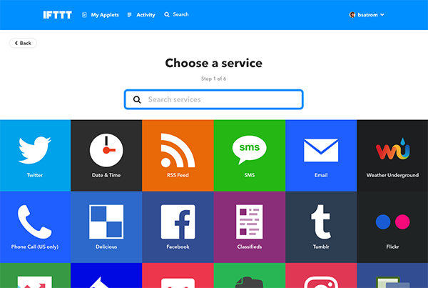
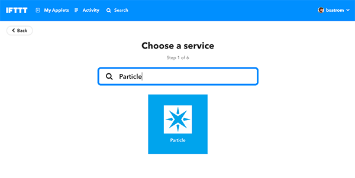
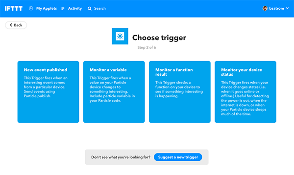

# Chapter 3: Using IFTTT & Azure IoT Hub

| **Project Goal**            | Connect your device to 3rd party services and "backhaul" sensor data to the cloud.                                                                                        |
| --------------------------- | ------------------------------------------------------------------------------------------------------------------------------------------------------------------------- |
| **What you’ll learn**       | How to port projects from the Web IDE to the desktop IDE; How to work with the Particle CLI; Building integrations with IFTTT; Piping sensor data into the Azure IoT Hub. |
| **Tools you’ll need**       | Particle Dev (Desktop IDE), a Particle Electron and IAQM Sensor                                                                                                           |
| **Time needed to complete** | 60 minutes                                                                                                                                                                |

In this session, we're going to explore the Particle Desktop IDE and CLI, before moving onto 3rd party integrations with IFTTT, Azure and Power BI.

## Moving to Particle Dev (Desktop IDE)

For the rest of this workshop, we're going to use the Particle desktop IDE. Thankfully, Particle makes it easy to grab your source from the Web IDE and continue in a desktop environment.

1.  If you haven't installed the Particle Dev Desktop IDE, [do that first, here](https://docs.particle.io/guide/tools-and-features/dev/#logging-in).

2.  Once you've installed the desktop IDE, head back to the Web IDE to grab your project from the last lab, so we can continue working on it.

3.  Next to the files list in the code view, you'll see a download icon. Click that to get a local copy of your app source as a Zip.


4.  Extract the zip to a location on your local machine.


5.  Open Particle Dev. Click the "File" menu, then "Open" and select the folder where you extracted the zip from step 4.


6.  The project will open with two files, one with an `.ino` extension and a `project.properties`


7.  Now, let's make sure the Electron we want to work with is selected. At the bottom of the IDE you should see the text "No devices selected".


8.  Click that to select the device you want to work with.


9.  Then, click on the "0.7.0" text next to the tag icon to choose a firmware version number.


10. We're going to use `0.8.0-rc.10` for the rest of this workshop, so select it from the list in the window that pops up.


11. Click the "lightning bolt" icon in the top left corner of the Desktop IDE. Once completed, your device should still operate as it did at the end of the last lab. Let's do some more stuff with it!


## Exploring the Particle CLI and Cloud API

### The Particle CLI

1.  If you haven't already, [Download the Windows CLI Installer and run it to install the Particle CLI](https://binaries.particle.io/cli/installer/windows/ParticleCLISetup.exe). Open a terminal window and type the following command:

```bash
bash <( curl -sL https://particle.io/install-cli )
```

2.  Type `particle login` and enter your Particle account email and password when prompted.


3.  Once you're logged in, type `particle list` to see your list of online devices.


4.  The device we've been using for this workshop has 4 variables and one function. Get the value of the `humidity` variable with the command `particle get humidity`.


5.  We can also call our `checkSensors` function. Type the command `particle call <your-device-name> checkSensors` in the terminal.


### The Particle Device Cloud API

Behind the scenes, every interface that Particle provides to work with devices, from the console, to mobile apps, SDKs, and the CLI talks through a RESTful Device Cloud API, which you can also call yourself, directly.

_The next few steps assume you have cURL installed on your machine. If you don't have this command-line utility on your machine, you can download and install it [here](https://curl.haxx.se/download.html) or use a GUI-based tool like [Postman](https://www.getpostman.com/)._

1.  First, you'll need to obtain an access token from the CLI. Type `particle token list` to view the tokens associated with your account. The first one listed is your `user` token, and can be used to access the Device Cloud API. If no tokens are listed, generate a new one with `particle token new`.

2.  With your token and Device ID in hand, type the following cURL command into a terminal window, replacing the text below in `< >` with your information.

```bash
curl https://api.particle.io/v1/devices?access_token=<your token>
```

By default, the response will generate a wall of text in your terminal. If you have Python 2.6+ installed on your machine, you can pipe the output to the `json.tool` and get pretty-printed JSON.

```bash
curl https://api.particle.io/v1/devices\?access_token\=<your token>
| python -m json.tool
```


3.  For this next command, you need the Device ID of your Electron. You can find that in the console or via the `particle list` CLI command.

4.  Let's call the `checkSensors` function using the Device Cloud API. Type the following, again replacing the text below in `< >` with your information.

```bash
curl https://api.particle.io/v1/devices/<device id>/checkSensors \
     -d access_token=<your token>
```


You've now explored a number of ways that you can interface with the Particle Device cloud and your connected devices! Now, let's go beyond the Particle ecosystem and explore some of the ways that you can integrate with other 3rd party services, and backhaul your data into other cloud services.

## Exploring Integrations with IFTTT

IFTTT (If This, Then That) is a web-based service that allows you to create integrations via simple conditional statements, called applets. There are hundreds of pre-built services you can leverage, and first-class support for Particle devices. In this section, we're going to create an IFTTT integration that posts a record to a Google Spreadsheet when your motion sensor fires a movement event.

1.  Start by heading over to [IFTTT](https://ifttt.com) and either login, or create a new account.


2.  After logging in, click "New Applet" in the top right of your dashboard.


3.  Click the "+this" button.


4.  In the "Search services" input, type "particle" and click on the Particle card.





5.  Click on the "New event published" card.



6.  In the trigger fields, set the event name as `movement_detected` the event contents to `red` and the Device name to the name of your device. Click "create trigger."


7.  You've set up the trigger on the Particle end, now its time for the **That** portion of the setup. Click the "+that" button.


8.  Search for and select the "Google Sheets" card.


9.  Click the "Add row to spreadsheet" action card. You may be prompted to connect your Google account to IFTTT at this point. Follow the instructions provided to do so.


10. For the action fields, feel free to customize the spreadsheet name, row and path, or keep the defaults. You can click "Add ingredient" to see what other fields are available to use. Click "Create action" when you're done.


11. Click "Finish"


12. You're all set! Toggle the switch to turn your action on if it isn't by default.


13. We've already added the `movement_detected` event in the last lab, so trigger that event a few times and make sure the events are firing in the console.

14. Navigate to your Google Drive account. You should see a new folder with the name you specified.


15. Open the spreadsheet, and you'll see a list of triggered events.


## Getting Device Data into the Azure IoT Hub

For these next two sections, we're going to leverage Particle's built-in support for the Azure IoT Hub to stream our sensor data to Azure. From there, we'll set-up an Azure Streaming Analytics job to transform our data, send the data to Power BI and create dashboards to visualize the data.

### Setting up an Azure IoT Hub

1.  Sign up for an [Azure Account](https://azure.microsoft.com/en-us/get-started/), or sign in if you already have one.


2.  In the dashboard, click "Create a resource." Click "Internet of Things," then "IoT Hub" at the top of the list.


3.  Create a new resource group named `workshop-group` and give the hub a name. The name must be unique across all of Azure, but you'll receive a notification if the name you selected is not unique.


4.  Click "Review + create".


5.  Click "Create".


6.  You'll get a notification that your IoT Hub is being deployed, which may take a few minutes. Once done, pin the hub to your dashboard.


7.  Click "Go to resource" to open the hub.


8.  Click "Shared access policies". We'll create a policy to allow the Particle Device Cloud to stream events into the hub.

9.  Give the policy the name `workshop-policy`, select all four permissions, then click "Create."


10. Open the policy you just created and copy the "Primary key."


Now we can complete setting up this integration from the Particle Console.

### Setting up the Particle Integration

1.  Navigate to [console.particle.io](https://console.particle.io) and click the "Integrations" menu item.


2.  Click "New Integration."


3.  Choose "Azure IoT Hub."


4.  You'll see a "Setup required" notice. We've already done all the things needed here, so you can click on "I have done all these things."


5.  Now we need to add an event we cant to capture, and some of the details from our event hub. For the event name, use `device-sensors`. The "IoT Hub Name" should be the unique name you used earlier. The "Shared Policy Name" will be `workshop-policy` and the "Shared Policy Key" is the primary key you copied in step #10 above.


6.  Save your integration and you'll be taken to the "View Integration" page.


7. Since we've already added the `device-sensors` event, after a few seconds, we should be able to confirm that the integration works. Refresh the integration page and scroll down to the `Logs` section. You should see one or more entries in the list.


8. Click on one of the logs to view the request, in detail.


9.  To verify that your integration worked, go back to your Azure IoT Hub and click on the "IoT Devices" menu item. If you see a single device in the list with your device ID you're good to go.


### Viewing IoT Hub Events

With the event set up, everything should be piping into the Azure IoT hub. We can verify using the [iothub-explorer command line utility](https://docs.microsoft.com/en-us/azure/iot-hub/iot-hub-explorer-cloud-device-messaging?WT.mc_id=7061727469636c65).

1.  Install the iothub-explorer using the instructions [here](https://github.com/azure/iothub-explorer).

2.  Navigate to your IoT Hub in the azure portal, and return to your shared access policy, `workshop-policy`. Copy the Connection string. You'll need this to authenticate with the iothub-explorer.


3.  Open a terminal window and type in the following command, replacing the `<device-id>` with the ID of your Electron and pasting the Shared access policy connection string in place of `<connection-string>` after login. Make sure to leave the quotation marks in place.

```bash
iothub-explorer monitor-events <device-id> --login "<connection-string>"
```

If you've authenticated correctly, you'll see the message "Monitoring events from device `<device-id>`...". After a moment, you should see events streaming into the Azure IoT Hub!


Once you're streaming device data into the Azure IoT Hub, you can pipe the data into Azure table storage, set-up streaming analytics to transform the data, create Azure Web Apps, reports with Power BI, use Azure Machine Learning, and more! In the next section, we'll set-up a streaming analytics job and visualize our data in Power BI.

## Streaming Device Data into Power BI

### Add a new Consumer Group to IoT Hub

1. In your IoT Hub, select "Endpoints" under the "Messaging" section and then click on "Events" under Built-in Endpoints.


2. Add a new Consumer Group. Call it "stream". Click the "Save" button at the top.


### Setting Up Stream Analytics

1. Create a new Stream Analytics Job in the Azure Portal


2. Give it a name and put it in the same resource group as your IoT Hub. Click "Create".


3. Once the resource is created, you can click on the bell in the right-hand corner to access it. It's also a good idea to pin it to the dashboard at this time.


4. Under the section "Job Topology", select "inputs"


5. Click on "Add Stream Input" and select "IoT Hub"


6. Name it "iothub". Select the correct IoT Hub from your subscription. Change the "Shared access policy name" to the policy you created in Chapter 3. Change the "Consumer Group" to the group you created in the first part of this chapter. Click "Save"


7. Under the "Job Topology" section, select "Outputs". Click the "Add" button and select "Power BI" from the dropdown list.


8. Name it "powerbi". You will need to authorize the Azure Portal to Power BI at this point.


9. Once you have done that, you can use the "My Workspace" Group Workspace. Name the Dataset "Continental" and the table "IAQMData".


### Create a UDF and Query

At this point, we're ready to create a query that will transform our input event data into something that we can use for visualizations in Power BI. Stream Analytics uses a SQL-like query language, and also supports the creation of User-Defined Functions (UDFs) to aid in the transformation of data. Since the `data` property of our event payload is a JSON-compatible string, we'll create a few UDFs to help us extract each reading.

1. Under the "Job topology" section of your Stream Analytics job, click the "Functions" item.


2. Click "New" and select the "JavaScript UDF" option


3. Give the first function the name `fetchValueByKey` and copy the code below into the text area. Click "Save."

```js
function fetchValueByKey(jsonString, key) {
  let obj = JSON.parse(jsonString);

  return obj[key];
}
```


4. Add a second function called `getDate` and copy in the code below. Click "Save." This function will give us a proper date object for the `lastMotion` field.

```js
function getDate(jsonString, field) {
  let obj = JSON.parse(jsonString);
  return new Date(parseInt(obj[field]);
}
```

5. Add a third function called `getDust` and copy in the code below. Click "Save."

```js
function getDust(jsonString, field) {
  let obj = JSON.parse(jsonString);
  let dust = obj.dust;

  return dust[field];
}
```

You should now have three UDFs listed in your Fuctions view.


6. Click on the "Query" option under "Job Topology". Enter the following query. Notice that we're using our JavaScript UDFs to transform the data and put it into a single output table for Power BI.

```sql
SELECT
    DEVICE_ID AS Device,
    EVENT AS Event,
    PUBLISHED_AT AS Published,
    CAST(UDF.fetchValueByKey(DATA, 'temp') AS BIGINT) AS Temperature,
    CAST(UDF.fetchValueByKey(DATA, 'humidity') AS BIGINT) AS Humidity,
    CAST(UDF.fetchValueByKey(DATA, 'tvoc') AS BIGINT) AS TVOC,
    CAST(UDF.fetchValueByKey(DATA, 'co2eq') AS BIGINT) AS CO2eq,
    CAST(UDF.fetchValueByKey(DATA, 'lightLevel') AS FLOAT) AS LightLevel,
    CAST(UDF.getDate(DATA, 'lastMotion') AS DATETIME) AS LastMotion,
    CAST(UDF.getDust(DATA, 'lpo') AS FLOAT) AS LPO,
    CAST(UDF.getDust(DATA, 'ratio') AS FLOAT) AS Ratio,
    CAST(UDF.getDust(DATA, 'concentration') AS FLOAT) AS Concentration
INTO
    powerbi
FROM
    iothub
```

Don't forget to click "Save".


10. Click on the "Overview" item and click the "Start" button to start the Stream Analytics job. After several seconds, the job will start and begin streaming event data into Power BI.


### Create a Live Streaming Power BI Dashboard

1. Log in to Power BI at [powerbi.microsoft.com](powerbi.microsoft.com)

2. Click on the "My Workspace" section in the sidebar. Click the + button in the corner to create a new dashboard.


3. Name the dashboard "IAQMDashboard"


4. Click the "Add Tile" button


5. Scroll down on the right-hand side, select "Custom Streaming Data" and click "Next". Then select "Continental". Click "Next".


6. Select the "Line chart" visualisation type. For the "Axis", click "Add value" and select "published". Scroll down a little further to the next "Value" field and select "temperature". Add another value and select "humidity". Set the time window to 10 minutes, then click "Next".


7. Add any tile details you like and click "Apply"


You should now have a line chart that will update every 10 seconds with the current temperature and humidity readings from your device. It's still a bit hard to know exactly what the current temperature is. See if you can add another tile on your own which pulls from the streaming data set and just shows the current temperature.


8. Now, use what you've learned to create another line chart with the Dust sensor values, and another card with the current light level.


---

**Congratulations! You've completed this workshop. Now you're a Particle Master! Take a moment to pat yourself on the back and bask in your newfound IoT-commandery. And if you want to take your exploration further, click the link below!**
