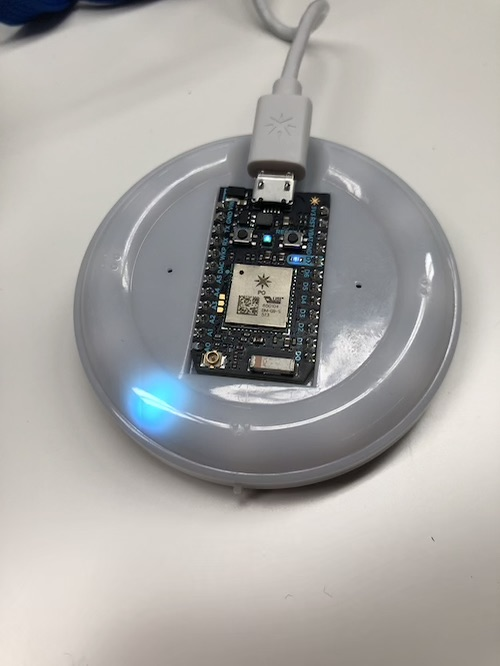
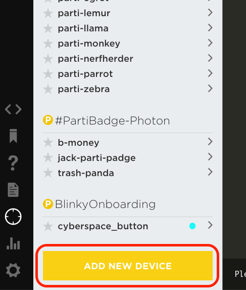

# Chapter 1: Claiming Your Particle Device

| **Project Goal**            | Get your Particle Photon online and claimed to your account                                 |
| --------------------------- | ------------------------------------------------------------------------------------------- |
| **What you’ll learn**       | How to claim a new Particle device from the Web IDE. How to program the device with Tinker. |
| **Tools you’ll need**       | An Internet Button with Photon, the Particle Web IDE.                                       |
| **Time needed to complete** | 15 minutes                                                                                  |

## Before you start

1.  Create a new [Particle account](https://login.particle.io/signup)
2.  Install the Particle [iOS](https://itunes.apple.com/us/app/particle-build-photon-electron/id991459054?ls=1&mt=8) or [Android](https://play.google.com/store/apps/details?id=io.particle.android.app) App.

## Claiming your Internet Button

1. Remove your Internet Button from the tin. Plug the included USB cable into the Photon and your computer.

2. Open the [Particle Web IDE](https://build.particle.io) and log in with your Particle account.

3. Click the target icon in the lower left corner to open the devices tab.

4. At the bottom of the devices window, click the "Add new Device" button. You may need to scroll to see it.

5. In the pop-up window, you'll be asked to claim your device by its device ID. You'll need to look up the device ID using the serial # on the bottom of the Internet Button tin.

6. Open [this spreadsheet](https://docs.google.com/spreadsheets/d/1Wi1Gl9pJ0cDpA8i_BLpvXhVEbGZWPKAIltkGNJM6SgA/edit#gid=700841690) and copy the Device ID that corresponds to the serial number of your Internet Button.

7. Paste the device ID into the pop-up window and click "Claim a Device." The device will be added to your account and you'll be asked to give it a name!

## Interacting with your Photon with Tinker

Now that you've claimed your Photon, let's light up an LED!

**Note**: images below are from the iOS app. The flow of the Android setup experience is similar.

1.  Open the Particle Mobile App.

2.  Your new device should show up in the list with the name you gave it. If the Tinker firmware is still on the device, you'll see that indicated as well. If Tinker is not still on the device, you can flash it back onto the device using the Particle CLI with the command `particle flash <deviceName> tinker`.

Tap the device you want to interact with via Tinker.

3.  When you select a device flashed with the Tinker firmware, you'll see a list of all the GPIO pins on the Photon, eight on each side, or 16 in total. With Tinker, you can control the digital and analog pins via reads and writes. If you have sensors or actuators connected to the Photon, you can control them with Tinker.

4.  Every Photon has a blue LED that's connected to pin D7, and we can use Tinker to control this LED. Tap on the circle marked "D7" and you'll see a pop-up that gives you two options, `digitalRead` and `digitalWrite`. We'll learn more about what these mean in the next lab. For now, click on `digitalWrite`.

5.  Once you select `digitalWrite` the pin button will be highlighted in red and show its current value. At first, this value will be digital `LOW` (or 0).

6.  Tap the button. You'll notice that it changed to `HIGH` (or 1).

7.  When the value changes to high, you'll also notice that the blue light at D7 is on! Behind the scenes, Tinker is calling the `digitalWrite` and passing in either a `LOW` or `HIGH` value, which turns the LED off or on. Press the button again and you'll note that the LED turns back off.

Congratulations! You've claimed and named your first Photon, and made it light up using the Tinker app. Now lets get your device connected to the Internet Button breakout and start flashing some lights!
