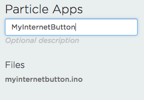
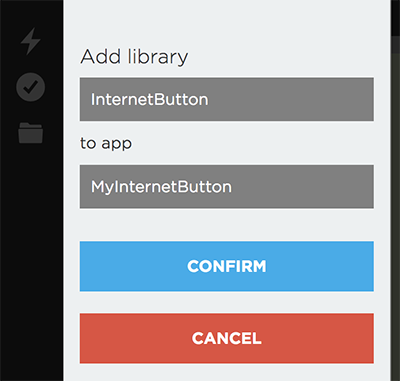
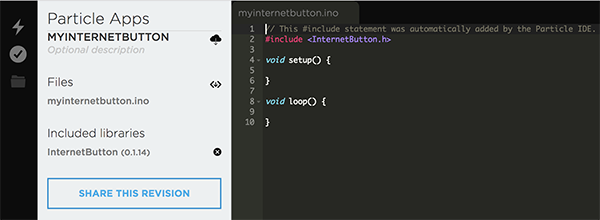
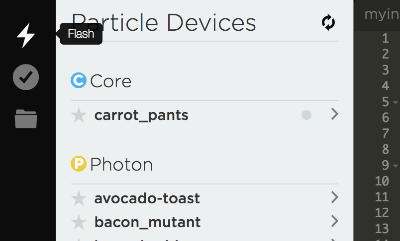
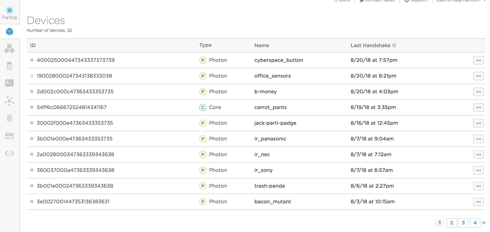
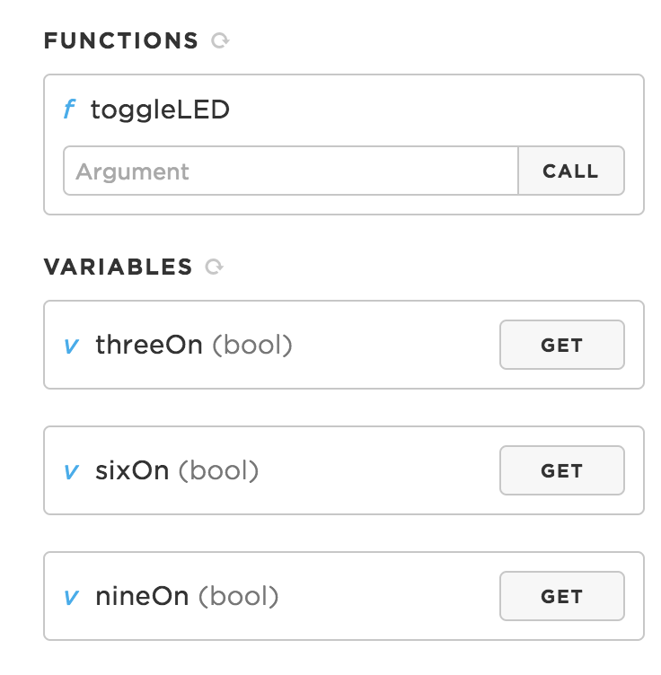
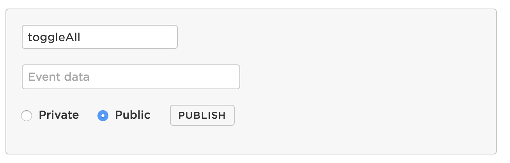
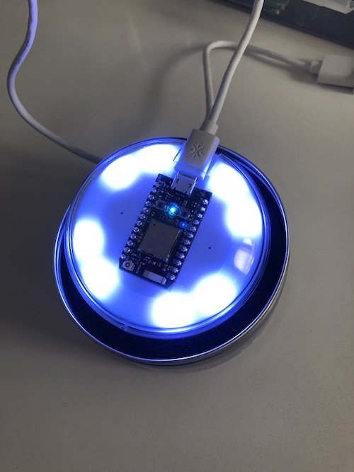

# Chapter 2: Blinking lights and buttons!

| **Project Goal**            | Start programming your Photon and Internet Button.                                                                      |
| --------------------------- | ----------------------------------------------------------------------------------------------------------------------- |
| **What you’ll learn**       | How to install libraries, using the Web IDE to flash devices, lighting up button LEDs and responding to button presses. |
| **Tools you’ll need**       | build.particle.io, a Particle Internet button.                                                                          |
| **Time needed to complete** | 20 minutes                                                                                                              |

In this session, we're going to start exploring the Particle ecosystem with the help of the Photon-based Internet Button, a small device that's jam-packed with RGB LEDs, four buttons, an accelerometer and a buzzer for emitting tones.

If you get stuck at any point in this process and need help, [click here](https://go.particle.io/shared_apps/5b7b7bd3ce03480428000a26) for the completed application.

## Create a new project in the Web IDE

1.  Navigate to [build.particle.io](http://build.particle.io). You may need to log-in, if prompted.


2.  Once you log-in, you may be directed to the Particle home page. If so, [click here to navigate](https://build.particle.io) back to Particle Build.


3.  When navigating to the Web IDE (Build), the first thing you'll see is an empty editor window for a new project and a prompt to give that project a name.


4.  In the Current App textbox, give your app the name "MyInternetButton" and hit enter.



5.  Once you've given your project a name, you're ready to code!


## Install the Internet Button Library

Before we access the sensors and LEDs on your Internet Button, we need to install the Internet Button library. This is a Particle-managed library that provides a set of simple abstractions for working with the Internet Button, from detection motion and orientation to playing light animations.

1.  In the Build IDE. Click the library icon to open the libraries tab.


2.  Choose the "Internet Button" library from the popular list (it will appear at the top).


3.  Click "Include in Project."


4.  Select your "MyInternetButton" project from the list. Click "Confirm" when prompted.




5.  Once the library is included, you'll see it in your list of included libraries, as well as a `#include` statement at the top of your project source.



Now that we have the library, let's blink an LED.

## The `setup()` and `loop()` functions

Before we dive into our first bit of code, a brief word about the two functions that were auto-populated into your new app. If you've done Arduino or Particle development before, you're already familiar with these and can skip ahead. If not, read on.

Every Particle application _must_ have two functions in the main file (sometimes called a "sketch"): `setup()` and `loop()`. Both of these functions are called by the Particle Device OS.

True to its name, `setup()` runs only only once when the device starts up and is used for initializing buttons, sensors and other things needed to get your project ready to execute.

`loop()`, on the other hand, runs over and over again as long as your firmware is running on the device. When the function is called by the device OS, the code inside executes sequentially until it reaches the closing brace of the function, before being called again.

While the speed at which the `loop()` function executes is determined by the specific hardware and the time needed to execute the use code you've written in the function, it's important to know that, much of the time, this function will run very fast.

The bulk of your program, from state management, handling user input, reading from sensors and more will take place inside of the `loop()` function. It can take a bit of getting used to if you're not familiar with this style of development, but once you become comfortable, you'll enjoy the power this control provides you as a firmware developer.

## Light up an LED

1.  To access the LEDs on the Internet button, we'll use the `InternetButton` object. Let's start by creating an instance before the `setup()` function

```cpp
InternetButton btn = InternetButton();
```

2.  Now, inside of the `setup()` function, we'll initialize the button.

```cpp
btn.begin();
```

3.  The Internet Button is ringed by 11 Red-Green-Blue (RGB) LEDs. The LEDs are numbered clockwise 1-11, starting to the left of the Photon with the USB connector facing up.


4.  To turn on an individual LED, we use the `ledOn` method of the `InternetButton` class. This method takes the numeric position of an LED to turn on (1-11) and three integer values representing the amount of red, blue and green to "turn on." Each value must be between 0 (off) and 255 (completely on). Let's turn on the LEDs at the 3 o'clock, 6 o'clock and 9 o'clock positions. Add the following to the `loop` function.

```cpp
btn.ledOn(3, 255, 0, 0); // Red
btn.ledOn(6, 0, 255, 0); // Green
btn.ledOn(9, 0, 0, 255); // Blue
```

5.  We want to blink these lights, so we'll need to turn them off. If we add the off commands right after the previous code, the lights will strobe very rapidly. We can slow things down by using the `delay` command, which tells the Photon to pause execution for a certain number of milliseconds. Add the following below the `ledOn` lines to delay the program for one second (1000 milliseconds).

```cpp
delay(1000);
```

6.  Next, we'll turn the LEDs off. The `ledOff` command takes just the position of the LED you want to turn off. Add the following after the `delay`. Notice we added another `delay` after turning all the LEDs off. Since the `loop` function repeats as soon as execution is complete, this gives us another pause before the lights turn back on.

```cpp
btn.ledOff(3);
btn.ledOff(6);
btn.ledOff(9);

delay(1000);
```

7.  Now let's flash this code. In the lower right of the web IDE, you'll see either the name of a device or the message "no device selected." Click to open up the devices tab.


8.  In the devices tab, click the star next to your Internet Button to select it.


9.  Now, to flash your device, click the lightning bolt in the upper left corner of the Web IDE.



10. After a few moments, your Internet Button should reset and you'll be greeted by blinking lights!


## Light up an LED on a button press

The Particle Internet Button also has four buttons mounted on the back, under the 12, 3, 6 and 9 o'clock positions. For this next exercise, let's light up an LED when a button is pressed.


1.  In the `loop` function, remove the code from the last exercise and add the following.

```cpp
if(btn.buttonOn(2)){
  btn.ledOn(3, 255, 0, 0);
}
else {
  btn.ledOff(3);
}
```

This time, instead of turning on the LEDs based on a delay, we'll do so when the button underneath is pressed. The button underneath the 3 o'clock LED is #2, so we'll call the `buttonOn` method and pass in the number 2. If the button is currently being pressed, this will return true and we'll light up the LED. Otherwise, we'll turn the LED off.

2.  Now, let's do the same for the two buttons underneath the 6 o'clock and 9 o'clock LEDs.

```cpp
if(btn.buttonOn(3)){
  btn.ledOn(6, 0, 255, 0);
}
else {
  btn.ledOff(6);
}

if(btn.buttonOn(4)){
  btn.ledOn(9, 0, 0, 255);
}
else {
  btn.ledOff(9);
}
```

3.  Click the lightning bolt to flash the latest code. Once finished, try clicking the buttons and be amazed as the LEDs respond!


4.  Before we move on, let's look at an LED animation. Add the following two lines to the end of your `setup` function and flash the firmware again. What do you see?

```cpp
btn.rainbow(20);
btn.allLedsOff();
```

## Using Particle Primitives to control LEDs

We've controlled our Internet Button LEDs on delays and button-presses, which is great. But this is an Internet Button, so let's put some Internet all up in it!

1.  First, we need some variables to hold the state of our LEDs. Add these three lines to the top of the file, just after the `#include`.

```cpp
bool isThreeOn = false;
bool isSixOn = false;
bool isNineOn = false;
```

2.  Now, let's add a function to toggle our 3, 6, and 9 o'clock LEDs. This function will be used by the `Particle.function()` primitive.

```cpp
int toggleLED(String command) {
  if (command == "3") {
    isThreeOn = !isThreeOn;

    return 1;
  } else if (command == "6") {
    isSixOn = !isSixOn;

    return 1;
  } else if (command == "9") {
    isNineOn = !isNineOn;

    return 1;
  }
  return 0;
}
```

When the function is called, a command will be passed specifying which LED to light up. Based on the value, we'll toggle the boolean state variable we specified at the top of the file.

3.  To let the Particle device cloud know about our variables and functions, we need to specify them in our `setup` function. Add the following to the start of `setup`.

```cpp
Particle.variable("threeOn", isThreeOn);
Particle.variable("sixOn", isSixOn);
Particle.variable("nineOn", isNineOn);

Particle.function("toggleLED", toggleLED);
```

4.  Finally, we need to use our state variables to light up the LEDs. Change the `loop` function from the last exercise to check for our state variables and a button press. The final result should look like this.

```cpp
if(btn.buttonOn(2) || isThreeOn){
  btn.ledOn(3, 255, 0, 0);
}
else {
  btn.ledOff(3);
}

if(btn.buttonOn(3) || isSixOn){
  btn.ledOn(6, 0, 255, 0);
}
else {
  btn.ledOff(6);
}

if(btn.buttonOn(4) || isNineOn){
  btn.ledOn(9, 0, 0, 255);
}
else {
  btn.ledOff(9);
}
```

5.  Flash the latest firmware and, after your device has restarted, navigate to [console.particle.io](https://console.particle.io). Select your device.



6.  On the right side, you'll see the list of variables and functions. If you click "Get" on the variables, you should see a return value of `false`.



7.  Enter "3" in the input box under `toggleLED` and click "Call". A red LED should light and a value of 1 returned. If you click on "Get" for `threeOn` again, the return value should now be `true`.


8.  Before we move on, let's explore one last primitive, `Particle.subscribe()`. Add the following line to your `setup` function.

```cpp
Particle.subscribe("toggleAll", toggleAll);
```

What we're doing here is telling the Particle cloud to look for events with the name `toggleAll` and, when these are fired, to call a handler function on our device.

9.  Add the handler function, before the `setup` function

```cpp
void toggleAll(const char *event, const char *data) {
  if (areAllOn) {
    btn.allLedsOff();
  } else {
    btn.allLedsOn(255, 255, 255);
  }

  areAllOn = !areAllOn;
}
```

We're checking the state of another boolean, here. If its true, we'll turn all the Internet Button LEDs off. Otherwise, we'll turn them on. Finally, we change the value of the boolean.

10. Speaking of that boolean, we need to add it to the top of our file, near the other state variables.

```cpp
bool areAllOn = false;
```

11. Flash the firmware to your device and wait for it to restart. Then, navigate back to the Console and look for the "Publish Event" button just above the event list.


12. Click the button and enter "toggleAll" for the event name. Select the "Public" radio button and click "Publish."



13. If everything worked correctly, you should see a ring of white lights around your Internet Button.



Now we have a true Internet Button! Next up, let's explore some enterprise features that allow our buttons to work together!
