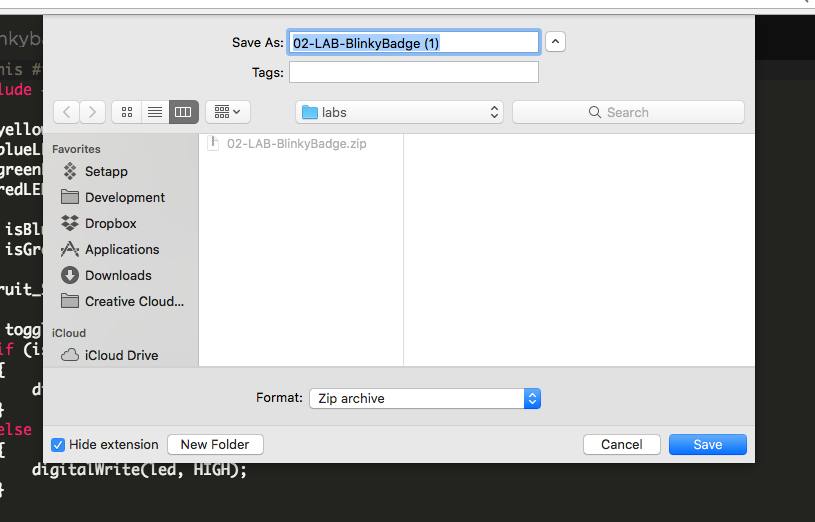

# Chapter 3: Input and sensor basics

| **Project Goal**            | Take control of the sensors and actuators on your badge. Read from and control devices.                                                                                    |
| --------------------------- | -------------------------------------------------------------------------------------------------------------------------------------------------------------------------- |
| **What you’ll learn**       | How to port projects from the Web IDE to the desktop IDE; reading from a temperature and humidity sensor; working with buttons and debouncing; working with a piezo buzzer |
| **Tools you’ll need**       | Particle Dev (Desktop IDE), a Particle Photon and #PartiBadge                                                                                                              |
| **Time needed to complete** | 30 minutes                                                                                                                                                                 |

In this session, we're going to explore more inputs and sensors on the badge, starting with the on board temperature and humidity sensor. From there, we'll explore how to interact with the buttons and joystick for input and finally, how to use the piezo buzzer to make sounds! If you get stuck at any point during this session, [click here for the completed, working source](https://github.com/particle-iot/particle-workshops/blob/master/demos/3-moresensors/src/finish.ino).

## Moving to Particle Dev (Desktop IDE)

For the rest of this workshop, we're going to use the Particle desktop IDE. Thankfully, Particle makes it easy to grab your source from the Web IDE and continue in a desktop environment.

1.  If you haven't installed the Particle Dev Desktop IDE, [do that first, here](https://docs.particle.io/guide/tools-and-features/dev/#logging-in).

2.  Once you've installed the desktop IDE, head back to the Web IDE to grab your project from the last lab, so we can continue working on it.

3.  Next to the files list in the code view, you'll see a download icon. Click that to get a local copy of your app source as a Zip.


4.  Extract the zip to a location on your local machine.



5.  Open Particle Dev. Click the "File" menu and select the folder where you extracted the zip from step 4.


6.  The project will open with two files, one with an `.ino` extension and a `project.properties`


7.  Now, let's make sure the Photon we want to work with is selected. At the bottom of the IDE you should see the text "No devices selected".


8.  Click that to select the device you want to work with.


9.  Then, click on the "0.7.0" text next to the tag icon to choose a firmware version number.


10. We're going to use `0.8.0-rc.9` for the rest of this workshop, so select it from the list in the window that pops up.


11. Click the "lightning bolt" icon in the top left corner of the Desktop IDE. Once completed, your badge should still operate as it did at the end of the last lab. Let's do some more stuff with it!


## Reading from the temperature and humidity sensor

To work with the on board temperature and humidity sensor, we'll use a library that wraps up all of the internals of dealing with this particular I2C device.

### Installing the `Si7021` library

1.  To install a library in Particle Dev, click the bookmark icon.


2.  In the "Particle Libraries" tab that opens up, type "Si7021" in the search box and hit enter.


3.  Click the "Use" button for the "Adafruit_Si7021" library and select "Add to current project."


4.  Open your `project.properties` file and verify that you now have two entries, including for the library you just added.


### Reading from the `Si7021` temp and humidity sensor

1.  Add an `include` reference to the top of your project, just after the reference for the `SSD1306` library.

```cpp
#include <Adafruit_Si7021.h>
```

2.  Add a line to initialize the sensor right after the code to initialize the display.

```cpp
Adafruit_Si7021 sensor = Adafruit_Si7021();
```

3.  Add a global variable to hold the current temp and humidity.

```cpp
int currentTemp;
int currentHumidity;
```

4.  At the start of `setup`, add a call to `sensor.begin()` to initialize the sensor.

```cpp
sensor.begin();
```

3.  Also in the `setup` function, add Particle variables for the temp and humidity.

```cpp
Particle.variable("temp", currentTemp);
Particle.variable("humidity", currentHumidity);
```

4.  Finally, at the end of `setup`, add the following code to read from the sensor:

```cpp
currentTemp = round((sensor.readTemperature() * 1.8 + 32.00) * 10) / 10;
currentHumidity = round(sensor.readHumidity()*10)/10;
```

For the temperature, the `readTemperature()` function returns Celsius by default, so we'll convert i to F. And the `* 10/ 10` gives us clean integer values for the global variables.

5.  Flash your device and visit its dashboard page in the console. You should see two new variables under the `greenOn` variable you defined in the last lab.


6.  Click on "Get" for either variable and you'll see the values from the initial reading.


## Writing temp and humidity data to the display

It's cool to be able to publish temperature and humidity to the cloud, but your badge also has a screen, so let's put it to work!

1.  In the last section, we had the badge read the temp and humidity on startup. Let's do that via a cloud function instead. First, add a new `Particle.function()` to `setup`.

```cpp
Particle.function("dispTempHu", displEnvSensors);
```

2.  Add the `displEnvSensors` function before `setup`.

```cpp
int displEnvSensors(String command) {
  currentTemp = round((sensor.readTemperature() * 1.8 + 32.00) * 10) / 10;
  currentHumidity = round(sensor.readHumidity()*10)/10;

  display.clearDisplay();
  display.setTextWrap(true);
  display.setTextColor(WHITE);
  display.setTextSize(2);
  display.setCursor(0, 20);
  display.printlnf("Temp: %if", currentTemp);
  display.printlnf("Hu: %i%%", currentHumidity);
  display.display();

  return 1;
}
```

Much like when we displayed a name on our badges in the last lab, we'll use several convenience functions of the `Si7021` library to make it easy to write to the screen. One difference to note is the call to `setCursor`. Instead of setting the cursor to the top left of the display, here it is set to start writing text at x position 0 and y position 20 pixels, which effectively centers the text vertically.

3.  Flash the latest firmware to your device and return to the console. Click on the `dispTempHu` function and the latest values will be written to the screen.


## Working with buttons

1.  Before we start working with the badge inputs, let's add pin references for them at the top of the project, just after the `#include` statements.

```cpp
/* LED Buttons */
#define RED_BUTTON_A WKP
#define BLUE_BUTTON_B A5
#define GREEN_BUTTON_C DAC
#define YELLOW_BUTTON_D A4
```

`#define` is a special preprocessor directive that allows us to give meaningful names to things in our firmware code without needing to take up memory with variables, like we did with the LEDs in the previous lab. Whenever the compiler builds the firmware binaries, it replaces any mention of one of these values (like `BLUE_BUTTON_B`) with the substitution value specified on the right-hand side (in this case `A5`). Using `#define` is pretty common when working with GPIO pins as it makes it easy to remember which pins one is working with without having to create constants or repeatedly scroll up to reference the correct GPIO mapping.

2.  With our buttons defined, lets take a look at toggling the LEDs based on button presses. First, remove the `digitalWrite` and `delay` calls that we added to the `loop` function previously.

3.  Next, set the `pinMode` for the red LED button.

```cpp
pinMode(RED_BUTTON_A, INPUT_PULLUP);
```

`INPUT_PULLUP` tells the Device OS that the default state of this PIN should be `HIGH`, as opposed to `LOW`.

4.  Now add the following to the `loop` function and flash the new firmware to your device.

```cpp
if (digitalRead(RED_BUTTON_A) == HIGH)
{
    digitalWrite(yellowLED, HIGH);
}
else
{
    digitalWrite(yellowLED, LOW);
}
```

5.  The yellow button will light up once the device restarts and will turn off when you press the red button. Try pressing slowly, then fast, then pressing and slightly releasing the button several times. Does it feel responsive, or slightly off? Chances are the button will seem responsive sometimes, but seem slightly out of sync at other points. This is because the contacts of the button bounce a number of times before contact is fully made. It's a good practice to add a software debounce library to help clean this up.

6.  Click on the libraries menu and type "debounce" in the search bar.

7.  Click "Add to Current Project", then add it to your list of includes at the top of the project

```cpp
#include "Debounce.h"
```

8.  We're going to add debounce functionality to our blue button and use it to light up the green LED. Add a `Debounce` object to the global scope before any function.

```cpp
Debounce blueButtonBDebouncer = Debounce();
```

9.  In setup, configure the debouncer just after the `pinMode` call you added for the red button.

```cpp
blueButtonBDebouncer.attach(BLUE_BUTTON_B, INPUT_PULLUP);
blueButtonBDebouncer.interval(20);
```

Behind the scenes, the `Debounce` library is setting the blue LED button up with a `pinMode` of `INPUT_PULLUP`, while also setting a debounce interval for the button. this value represents the number milliseconds to sample the button before determining whether it has been pressed, or not. By sampling over time, we can let the switch contacts settle in place.

10. Finally, let's read from the button. Add the following to the `loop` function

```cpp
blueButtonBDebouncer.update();
if (blueButtonBDebouncer.read() == HIGH)
{
    digitalWrite(greenLED, HIGH);
}
else
{
    digitalWrite(greenLED, LOW);
}
```

Calling `update` tells the library to sample the button across the interval we specified. Then, `read()` will return `HIGH` or `LOW` based on that sampling.

11. Flash the new firmware and press the blue button. Does the green LED respond any faster or more consistently than the yellow LED to the red button? The buttons on your badge actually seem to behave pretty well, but its always a good idea to debounce your buttons and switches.

**For extra credit, why not add a debouncer to the red button before moving on?**

## Working with the Joystick

Now let's spend some time getting to know the joystick, and use its input to move something on the OLED display.

1.  The joystick on the badge is a five-direction tactile switch (up, down, left, right and center click). Each direction is mapped to a pin on the Photon. At the top of your project file, add `#define` statements for each:

```cpp
/* Joystick Buttons */
#define JOYSTICK_UP D6
#define JOYSTICK_DOWN D5
#define JOYSTICK_LEFT D4
#define JOYSTICK_RIGHT D3
#define JOYSTICK_CENTER D2
```

2.  We're going to use a built-in library function to draw a circle on our screen, and then move it by manipulating the x and y position of that circle before redrawing it. We need a couple of variables to hold the x and y position, so add the following near the top of your project, outside of any function:

```cpp
int displayX;
int displayY;
```

3.  Next, let's add a `drawCircle` function before `setup`

```cpp
void drawCircle() {
  display.clearDisplay();
  display.drawCircle(displayX, displayY, 5, WHITE);
  display.display();
}
```

The `drawCircle` library function accepts 4 parameters, the x and y positions, the radius of the circle in pixels and the color (WHITE means the default screen color. In this case, our screens are blue.)

4.  Now, let's draw the circle to the display. Add the following to the end of your `setup` function:

```cpp
displayX = display.width()/2;
displayY = display.height()/2;
drawCircle();
```

5.  Since our joystick is actually a 5-way switch, its a good idea to use our Debounce library. Add the following after the debouncer we added for the blue LED button.

```cpp
// Debouncers for 5-way tactile switch
Debounce joystickUpDebouncer = Debounce();
Debounce joystickDownDebouncer = Debounce();
Debounce joystickLeftDebouncer = Debounce();
Debounce joystickRightDebouncer = Debounce();
```

6.  Let's also add a `#define` for the debounce interval at the top.

```cpp
#define DEBOUNCE_INTERVAL 20
```

7.  In `setup`, we'll initialize the debouncers for each button.

```cpp
joystickUpDebouncer.attach(JOYSTICK_UP, INPUT_PULLUP);
joystickUpDebouncer.interval(DEBOUNCE_INTERVAL);
joystickDownDebouncer.attach(JOYSTICK_DOWN, INPUT_PULLUP);
joystickDownDebouncer.interval(DEBOUNCE_INTERVAL);
joystickLeftDebouncer.attach(JOYSTICK_LEFT, INPUT_PULLUP);
joystickLeftDebouncer.interval(DEBOUNCE_INTERVAL);
joystickRightDebouncer.attach(JOYSTICK_RIGHT, INPUT_PULLUP);
joystickRightDebouncer.interval(DEBOUNCE_INTERVAL);
```

8.  In the `loop`, we'll check each debouncer and, if pressed, update the x or y position and re-draw the circle.

```cpp
joystickUpDebouncer.update();
if (joystickUpDebouncer.read() == LOW)
{
    displayY--;
    drawCircle();
}

joystickDownDebouncer.update();
if (joystickDownDebouncer.read() == LOW)
{
    displayY++;
    drawCircle();
}

joystickLeftDebouncer.update();
if (joystickLeftDebouncer.read() == LOW)
{
    displayX--;
    drawCircle();
}

joystickRightDebouncer.update();
if (joystickRightDebouncer.read() == LOW)
{
    displayX++;
    drawCircle();
}
```

9.  Flash the new firmware to your device and try moving the joystick up, down, left and right. Look at that circle go!


**For extra credit, how could you change the code above to _NOT_ redraw the circle each time, but add a new circle 1 pixel offset from the last?**

**For extra, extra credit, how would you implement collision detection so that the circle can't be moved beyond the bounds of the screen?**

## Working with the Piezo Buzzer

So far, we've worked with inputs and the screen, but there's one final output device that's worth exploring, the piezo buzzer!

1.  To play tones on the buzzer, we need some notes. Navigate to [this folder](https://github.com/particle-iot/particle-workshops/tree/master/demos/3-moresensors/src/music), download the files named `mario.h` and `notes.h` and place them in the source for your project.

The `notes.h` file contains a number of `#define` statements that maps the frequency values of each note to a readable name, `NOTE_D1` for instance, signifies 37Hz.

The other file, `mario.h` contains a couple of arrays for some familiar Mario-style tones. The first element of each array is an integer representing the number of notes in the tune. For the rest of the array, each "pair" of values on the same line represents the tone to play and the type of the note (quarter-note, eighth-note, etc.).

2.  Once you've added those files, add an include statement for `mario.h`. Note that the `tones.h` does not need to be included because its included by the `mario.h` file. If you placed these files in a folder, make sure to update the include below, accordingly.

```cpp
#include "mario.h"
```

3.  Next, let's add a `#define` for the Photon pin the piezo is mapped to.

```cpp
#define BUZZER_PIN TX
```

4.  Next, let's add a function to play tones on the buzzer

```cpp
void playTones(int tonePin, const int tones[])
{
  for (int i = 1; i < (tones[0] * 2 + 1); i = i + 2)
  {
    tone(tonePin, tones[i], (1000 / tones[i + 1]));
    delay((1000 / tones[i + 1]) * 1.30);
    noTone(tonePin);
  }
}
```

The `playTones` function expects the passed in array to have the format detailed above. The first element sets the number of tones and is used to set the number of times we pass through the `for` loop. For each iteration, the `tone` function is called, passing in the piezo buzzer pin, the frequency of the note to play, and the duration. The duration is calculated by dividing 1000 by the note type.

Next, we need to introduce a short delay between notes so that we can distinguish between them. It's common to do this with the note's duration plus 30%. Once that delay has passed, we call `noTone` to stop the buzzer before looping again.

5.  At the end of your `setup` function, call `playTones` and pass in one of the Mario arrays.

```cpp
playTones(BUZZER_PIN, notes_MarioStartup);
```

6.  Now flash the firmware to your device. When your device comes back online, you'll be greeted by a familiar tune!

**For extra credit, try implementing a tone or tune that plays when you press a button or move the joystick. How about a tone that increases in pitch when the joystick is pressed upward, and falls in pitch when pressed downward?**

You've learned a lot about Particle and common sensors, inputs and actuators over the last three labs. Now it's time to take our project to the cloud!
